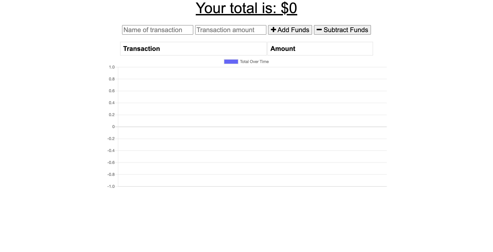
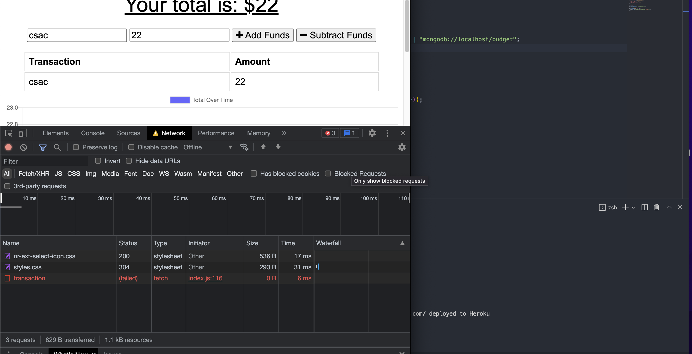

# Budget Tracker (PWA)

## Description
Budget Tracker is a progressive web application that allows users to manage their budgets by using the "Add/Subtract Funds" buttons to add costs and deposits to their budget. They can add a transaction whether or not there is a relationship. When a user initiates a transaction while offline, it is saved in the indexedDB and then transmitted to the database when the user reconnects.

## Table of Contents

- [Installation](#installation)
- [Usage](#usage)
- [Example Usage](#example-usage)
- [Offline](#Offline)
- [License](#license)
- [Contributing](#contributing)
- [Questions](#questions)

## Installation

To install the required dependencies, run `npm install`

## Usage

To start the server, run `npm start`. To access the app after starting the server, go to http://localhost:3001 in your browser.

## Example Usage

Deployed App: https://secure-island-29380.herokuapp.com/

An example screenshot of the application is below.

## Offline

## License

This project is licensed under the MIT License - see the [LICENSE](LICENSE) file for details.

## Contributing

If you want to contribute, open a Pull Request and include a detailed description and screenshots of the changes.

## Questions

If you have any questions about the repo, open an issue or contact https://github.com/Clos01 or @Cjrivas00@gmail.com    